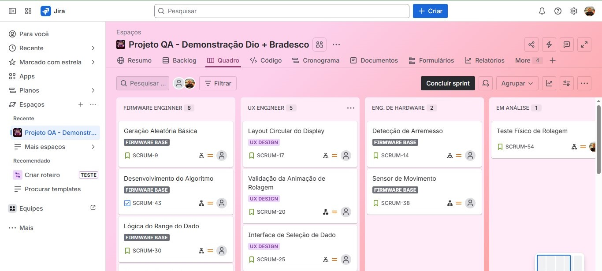

# 🎲 Projeto Demonstração: Sistema Eletrônico de Rolagem de Dados (D3–D100)

Esse repositório está associado ao board Scrum no Jira e foi criado como demonstração prática de como estruturo, organizo e conduzo um projeto real utilizando Jira + GitHub, seguindo metodologias ágeis.

Ele faz parte de uma atividade aplicada ao Bootcamp DIO + Bradesco, servindo como referência de boas práticas de documentação, planejamento e execução técnica.

## 👉 Board no Jira:

https://breezelabstudio.atlassian.net/jira/software/projects/SCRUM/boards/1

Além do propósito demonstrativo, o projeto também representa um estudo conceitual de um dado eletrônico inteligente, com seleção de tipos de dado, animações, sensor de movimento e integração de firmware.

## 🧭 Objetivo do Repositório

Este repositório cumpre **dois propósitos principais:**

### 1. Demonstração profissional de organização em Jira

Mostra como estruturo um **fluxo ágil completo:**

→ criação de epics  
→ stories detalhadas  
→ sprints organizadas  
→ categorização por áreas (firmware, UI, hardware, animação, QA)  
→ documentação clara e rastreável  

Demonstra como integro o Jira ao GitHub utilizando commits, branches e PRs vinculados a issues.

Funciona como portfólio prático sobre metodologia ágil para o Bootcamp DIO + Bradesco.

### 2. Centralização e documentação do projeto técnico

Agrupa notas, versões, códigos e decisões do protótipo do sistema de dado eletrônico;
 
Serve como hub organizacional entre desenvolvimento, testes físicos e design;

📁 Conteúdo Catalogado (Por Fluxos de Trabalho)

**Abaixo está o conjunto de tópicos, tarefas e áreas que servem tanto como documentação do projeto quanto como exemplo de estruturação profissional no Jira.**

## 🧠 1. Core Logic & Algoritmo

Desenvolvimento do algoritmo principal;

Lógica de geração aleatória;

Lógica de range para D3, D4, D6, D8, D10, D12, D20, D100;

Persistência de configurações;

Validação de distribuição;

Melhorias e refinamentos;

## 📟 2. Interface e Display

Interface de seleção do tipo de dado;

Layout do display circular;

Renderização e animação dos números;

Fluxo de troca de dados;

Ajustes de usabilidade;

## 🎞️ 3. Animações

Criação da animação de rolagem;

Testes de fluidez;

Ajustes de velocidade e easing;

Correção de travamentos;

## 🌀 4. Sensor de Movimento

Integração com acelerômetro;

Ajuste de thresholds;

Calibração automática;

Leitura e filtragem de ruído;

Detecção de arremesso;

## 🧩 5. Hardware & Design Físico

Prototipagem do corpo do dado;

Miniaturização dos componentes;

Adaptação para display circular;

Testes de encaixe e impacto;

## 🧪 6. QA & Validações

Testes físicos de rolagem;

Avaliação de responsividade;

Logs de comportamento;

Bugs identificados;

Direcionamento das correções às áreas responsáveis;

## 🚀 Este projeto exemplifica:

✔ Estruturação clara de backlog;

✔ Organização por epics, tasks, subtasks e labels;

✔ Sprints definidas com metas específicas;

✔ Integração Jira ↔ GitHub com rastreamento direto;

✔ Documentação contínua;

✔ Versionamento conectado ao status de desenvolvimento;

✔ Pipeline de QA com feedback contínuo;

✔ Comunicação clara entre áreas: Firmware | UI | Sensor | Hardware;

>Tudo isso aplicado como case prático para o **Bootcamp DIO + Bradesco.**
