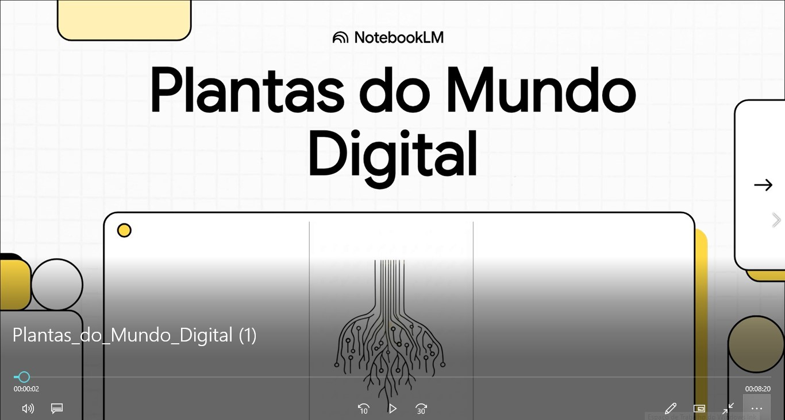

# 🌱 Natural ou Fake Natty?
**Como Vencer na Era das IAs Generativas**

>Um experimento sobre o que é natural — e o que apenas parece ser.

Olá pessoal, tudo bem?  
Inspirado na hype **“Natty or Not”** do fisiculturismo, este Lab da **DIO** me convidou a explorar o universo das **IAs Generativas**, investigando até que ponto algo criado com tecnologia pode soar **natural, humano e autêntico**.

Mais do que acompanhar tendências, a proposta aqui é **entender o uso prático e consciente dessas ferramentas**, indo além do hype e do efeito visual imediato.

🎯 Bora pro desafio!? 💪🤓

# Projeto: Plantas do Mundo Digital

  

O vídeo está no repositório, fique a vontade!

## 📒 Descrição

O ponto de partida foi um recorte do meu **NotebookLM**, transformado em um vídeo curto por meio de ferramentas de **IA generativa**.  
A intenção não é impressionar pela técnica, mas demonstrar, na prática, que conteúdos **simples, bem estruturados e com narrativa clara** podem ganhar vida com rapidez — incluindo **áudio em PT-BR fluido, natural e acessível**.

Em vez de buscar o hiper-realismo ou o “efeito uau” comum em muitas aplicações de IA, este projeto investiga algo mais cotidiano:  
**como usar essas ferramentas de forma consciente, funcional e criativa no dia a dia**.

Aqui, a IA atua como **extensão do processo humano** — apoiando a comunicação, o ensino e a construção de sentido.

O experimento propõe um uso possível para **educadores, estudantes, instituições e criadores**, onde a tecnologia não substitui o pensamento, mas **amplifica a capacidade de organizar, traduzir e compartilhar conhecimento**.

No fim, este projeto é menos sobre plantas digitais e mais sobre **cultivar ideias** em um ambiente onde **arte, cultura e tecnologia** coexistem em constante transformação.

## 🤖 Tecnologias Utilizadas

Este projeto combina **IA generativa**, ferramentas de organização de conhecimento e fundamentos do ecossistema **web3 / software moderno**, utilizadas não como vitrine tecnológica, mas como **instrumentos de mediação criativa**.

**ChatGPT (OpenAI)**  
  Utilizado como parceiro de raciocínio, estruturação narrativa e refinamento de linguagem, apoiando a escrita do script, a organização conceitual e a clareza didática.

**NotebookLM (Google)**  
  Base principal de coleta, síntese e organização de informações, funcionando como “solo fértil” do projeto, de onde os conceitos foram extraídos, conectados e transformados em narrativa audiovisual.

**Documentações Técnicas (fontes oficiais)**  
  O projeto se ancora em fundamentos e leituras provenientes de:
 **Web3** — conceitos, descentralização e novos modelos digitais  
 **Rust** — documentação oficial  
 **React** — documentação oficial  
 **Python** — documentação oficial  

## 🧐 Processo de Criação

O processo partiu de um método simples, intencional e replicável:

**Curadoria de conteúdo**
Anotações, reflexões e dados organizados previamente no **NotebookLM**, sem a preocupação inicial com o formato final.

**Estruturação narrativa**
Com apoio do **ChatGPT**, o conteúdo foi reorganizado em um fluxo lógico e didático, priorizando **clareza, ritmo e naturalidade** na fala.

**Tradução para audiovisual**
O script final foi aplicado em uma ferramenta de geração de vídeo por IA, com foco em:

Áudio em **PT-BR fluente**
Tom **neutro, humano e não robotizado**
Apresentação **direta**, sem excesso de efeitos

**Refinamento conceitual**
Ajustes finais garantiram que a tecnologia **servisse ao conteúdo** — e não o contrário.

## 🚀 Resultados

O resultado é uma **peça audiovisual curta, clara e funcional**, que demonstra ser possível:

Criar conteúdo educativo de forma **ágil**
Utilizar IA como **apoio criativo**, não como substituição humana
Transformar conhecimento técnico em algo **acessível**
Produzir materiais **replicáveis** para ensino, apresentação ou documentação

O projeto funciona tanto como **exemplo prático** quanto como **prova de conceito** para aplicações educacionais, institucionais ou experimentais.

## 💭 Reflexão

Criar algo que pareça “natural” (*natty*) com IA não é um desafio técnico —  
é um desafio **editorial e humano**.

Quanto mais a ferramenta evolui, mais importante se torna o papel de quem **seleciona, corta, organiza e dá intenção** ao conteúdo.  
A IA acelera processos, mas o sentido ainda nasce da **curadoria, da sensibilidade e da decisão consciente**.

Neste experimento, a tecnologia não tenta imitar o humano.  
Ela **amplifica o que já estava ali**.

