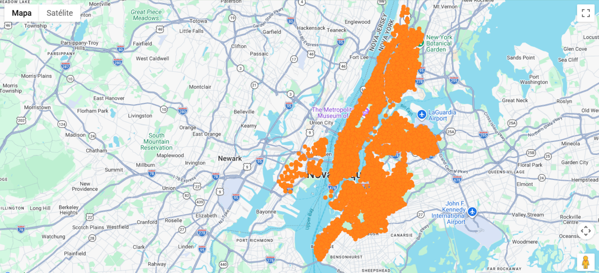

# 🌍 Interactive Map Visualization (Google Maps + Deck.gl)

Projeto de visualização de dados geoespaciais construído com **Google Maps JavaScript API** e **Deck.gl**, utilizando camadas dinâmicas para renderização de pontos baseados em dados estruturados.


<p align="center">
  
</p>

<p align="center">
  
</p>


A aplicação transforma um conjunto de dados geográficos em uma visualização interativa sobre o Google Maps, utilizando camadas de renderização do Deck.gl.

Cada ponto representa uma estação com base em coordenadas (latitude/longitude) e um valor de capacidade que define sua representação visual.


## ⚙️ O fluxo de execução do sistema segue estas etapas:

**1. Carregamento da Google Maps API**  
A API do Google Maps é carregada dinamicamente via script externo.

**2. Inicialização do mapa**  
O mapa é instanciado com centro e zoom definidos.

**3. Carregamento dos dados**  
O dataset `stations.json` é consumido contendo informações geográficas e atributos numéricos.

**4. Criação da camada de visualização**  
Os dados são processados pelo `ScatterplotLayer` do Deck.gl.

**5. Integração com o mapa**  
O `GoogleMapsOverlay` conecta a camada de dados ao mapa base.

**6. Renderização final**  
Os pontos são exibidos com variação visual baseada nos atributos do dataset.


## 🧱 A aplicação é composta por três camadas principais:


### 🗺️ Camada de Base (Google Maps)
Responsável pela renderização do mapa e controle de visualização geográfica.

### 📊 Camada de Dados (Deck.gl)
Responsável pela transformação dos dados em elementos visuais.

- `ScatterplotLayer`
- Mapeamento de latitude e longitude
- Escala de raio baseada em atributos

### 🔗 Camada de Integração
Conecta as duas camadas principais:

- `GoogleMapsOverlay`
- Sincronização entre mapa e visualização de dados


## 🧩 Stack utilizada

- JavaScript (ES6+)
- Google Maps JavaScript API
- Deck.gl
- @deck.gl/google-maps
- @deck.gl/layers
- HTML + DOM API


🔐 Observação importante

Ocultei minha chave API desse projeto, deixando somente a explicação do código e sua funcionalidade, logo, caso queira executar e visualizar em funcionamento, insira sua chave API:

```js
const googleMapsAPIKey = 'YOUR API KEY';
