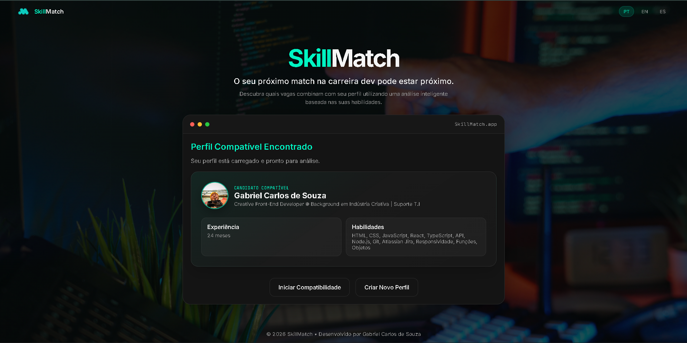

<p align="center">
  
</p>

<div align="center">

> Projeto desenvolvido como avaliação final do **Módulo 01** do curso **Desenvolvimento Web**, promovido pela **SCtec**.

O **SkillMatch Web** transforma o motor de compatibilidade desenvolvido anteriormente em JavaScript (Console) em uma aplicação Web completa, permitindo que candidatos informem seu perfil profissional e descubram seu nível de compatibilidade com vagas da área de tecnologia.

Este projeto reúne os principais conhecimentos apresentados ao longo do módulo em uma única aplicação.


 **📚 Conteúdos abordados**
<pre>
- HTML5 
- CSS3 
- JavaScript 
- Programação Orientada a Objetos 
- DOM 
- Eventos 
- Responsividade 
- SEO 
- Acessibilidade 
- Fetch API 
- LocalStorage 
- Modularização 
- Git 
- GitHub
</pre>

**🚀 Sobre o Projeto**

O **SkillMatch Web** simula uma plataforma de recrutamento para profissionais da área de tecnologia.

A aplicação permite que o usuário:
<pre>
- Cadastrar um perfil profissional;
- Analisar sua compatibilidade com diferentes vagas;
- Visualizar o percentual de compatibilidade;
- Identificar competências encontradas;
- Visualizar competências recomendadas;
- Receber sugestões de estudo.
</pre>
Todo o conteúdo da interface é renderizado dinamicamente utilizando **JavaScript puro**, sem frameworks.


**🔗 Links**

**Kanban:** https://trello.com/b/O1yQPu8x/sctec
**Vídeo Explicativo:** https://vimeo.com/1211456758?share=copy&fl=sv&fe=ci


**🔄 Fluxo da Aplicação**

<pre>
  Página Inicial
        │
        ▼
Perfil Encontrado
        │
        ▼
Novo Cadastro
        │
        ▼
Confirmação do Cadastro
        │
        ▼
Análise de Compatibilidade
        │
        ▼
Resultado das Vagas
        │
        ▼
Recomendação de Estudos
</pre>


**🏗 Arquitetura da Aplicação**

A aplicação foi organizada utilizando <strong>ES Modules</strong>, separando responsabilidades entre os módulos e facilitando a manutenção, escalabilidade e reutilização do código.

<pre>
main.js
   │
   ▼
Inicialização da aplicação
   │
   ▼
motor.js
   │
   ▼
Regras de negócio e compatibilidade
   │
   ▼
ui.js
   │
   ▼
Fluxo das telas e gerenciamento UI
   │
   ▼
componentes.js
   │
   ▼
Biblioteca de componentes reutilizáveis
   │
   ▼
terminal.js
   │
   ▼
Renderização, animações e efeitos
   │
   ▼
dados.js
   │
   ▼
Fetch das vagas e persistência em LocalStorage
   │
   ▼
i18n.js
   │
   ▼
Internacionalização da interface
</pre>


**📂 Organização dos Módulos**

<pre>
┌─────────────────────┬──────────────────────────────────────────────────────────────┐
│ Arquivo             │ Responsabilidade                                             │
├─────────────────────┼──────────────────────────────────────────────────────────────┤
│ main.js             │ Inicialização da aplicação                                   │
│ motor.js            │ Regras de negócio e cálculo de compatibilidade               │
│ ui.js               │ Fluxo das telas e gerenciamento da interface                 │
│ componentes.js      │ Biblioteca de componentes reutilizáveis                      │
│ terminal.js         │ Renderização, animações e efeitos visuais                    │
│ dados.js            │ Fetch das vagas e persistência em LocalStorage               │
│ i18n.js             │ Internacionalização da interface                             │
└─────────────────────┴──────────────────────────────────────────────────────────────┘
</pre>


**📌 Cadastro**

O cadastro presente nesta versão possui finalidade demonstrativa.

A interface já está preparada para envio dos dados. Entretanto, a persistência definitiva será implementada futuramente por meio de uma integração com **n8n**, permitindo automatizar o envio para bancos de dados, APIs ou CRMs sem necessidade de alterações na arquitetura da aplicação.

**✅ Requisitos Atendidos**

**⚙️ Motor SkillMatch:**

<pre>

- Perfil modelado em objeto ✅
- Catálogo de vagas em JSON ✅
- Cálculo de compatibilidade ✅
- Classificação automática das vagas ✅
- Identificação da melhor vaga ✅
- Recomendação personalizada de estudos ✅
- Utilização de métodos de Array (`map`, `filter`, `reduce`, etc.) ✅
- Programação Orientada a Objetos (POO) ✅
- Herança ✅
- Utilização de `this` ✅
- Callback ✅
- Closure ✅

</pre>
  
**🖥 Interface**

<pre>
  
- HTML semântico ✅
- SEO básico ✅
- Acessibilidade ✅
- Formulário com validação ✅
- Eventos utilizando JavaScript ✅
- Renderização dinâmica pelo DOM ✅
- Cards gerados dinamicamente ✅
- Responsividade (Mobile First) ✅
- Layout utilizando Flexbox ✅

</pre>

**💾 Dados**

<pre>

- Fetch API ✅
- Tratamento de carregamento ✅
- Tratamento para lista vazia ✅
- Tratamento de erros ✅
- Persistência utilizando LocalStorage ✅
- Armazenamento do perfil do candidato ✅

</pre>

**📁 Organização**

<pre>

- ES Modules ✅
- Arquitetura modular ✅
- Separação de responsabilidades ✅
- Git ✅
- GitHub ✅
- Kanban ✅
- README técnico ✅

</pre>

**⭐ Funcionalidades Extras**

Além dos requisitos obrigatórios, foram implementadas melhorias com foco em organização, escalabilidade, experiência do usuário e preparação para futuras evoluções da aplicação.

<pre>
⭐ Interface inspirada em terminal interativo
⭐ Sistema completo de Internacionalização (i18n)
⭐ Biblioteca de componentes reutilizáveis
⭐ Arquitetura modular desacoplada
⭐ Separação em camadas (Dados • Motor • Interface)
⭐ Sistema de renderização dinâmica
⭐ Preparação para integração com n8n
⭐ CSS organizado por blocos funcionais
⭐ Navegação refinada entre resultados
⭐ Estrutura preparada para futuras integrações com IA
</pre>

</div>


**🛠 Tecnologias Utilizadas**

| Categoria | Tecnologias |
|:----------|:------------|
| **Estrutura** | HTML5 |
| **Estilização** | CSS3 |
| **Programação** | JavaScript (ES Modules) |
| **Comunicação** | Fetch API |
| **Persistência** | LocalStorage |
| **Layout** | Flexbox |
| **Responsividade** | Mobile First |
| **Versionamento** | Git |
| **Repositório** | GitHub |


**🚀 Como Executar**

Clone o repositório:

```bash
git clone https://github.com/Gaabs13/Bootcamps-e-Estudos.git
```

Acesse a pasta do projeto:

```bash
cd Bootcamps-e-Estudos/SCTec/Projeto02-SkillmatchInterface
```

Abra a pasta utilizando o **Visual Studio Code**.

Caso possua a extensão **Live Server**, basta iniciar o servidor local.

> **Observação:** este projeto utiliza **ES Modules** e **Fetch API**. Por esse motivo, ele deve ser executado através de um servidor local, evitando restrições do navegador relacionadas ao carregamento de módulos e arquivos JSON.


**📁 Estrutura do Projeto**

```text
Projeto02-SkillmatchInterface
│
├── assets
│   ├── css
│   ├── img
│   ├── json
│   └── scripts
│       ├── componentes.js
│       ├── dados.js
│       ├── i18n.js
│       ├── main.js
│       ├── motor.js
│       ├── terminal.js
│       └── ui.js
│
├── index.html
└── README.md
```


**🔮 Melhorias Futuras**

<pre>
  
- Integração completa com **n8n**
- Persistência em banco de dados
- Sistema de autenticação de candidatos
- Painel administrativo
- Recomendações utilizando Inteligência Artificial
- Tradução para novos idiomas
- Dashboard de métricas
- Exportação de currículos em PDF
- Área para empresas cadastrarem vagas
- Deploy em ambiente de produção

</pre>  


>Projeto desenvolvido por mim, **Gabriel Carlos de Souza**, como avaliação final do **Módulo 01** do curso **Desenvolvimento Web**, promovido pela **SCtec**.


>⭐ Se este projeto foi útil ou interessante para você, considere deixar uma estrela no repositório.

**Obrigado pela visita! 🚀**

</div>
